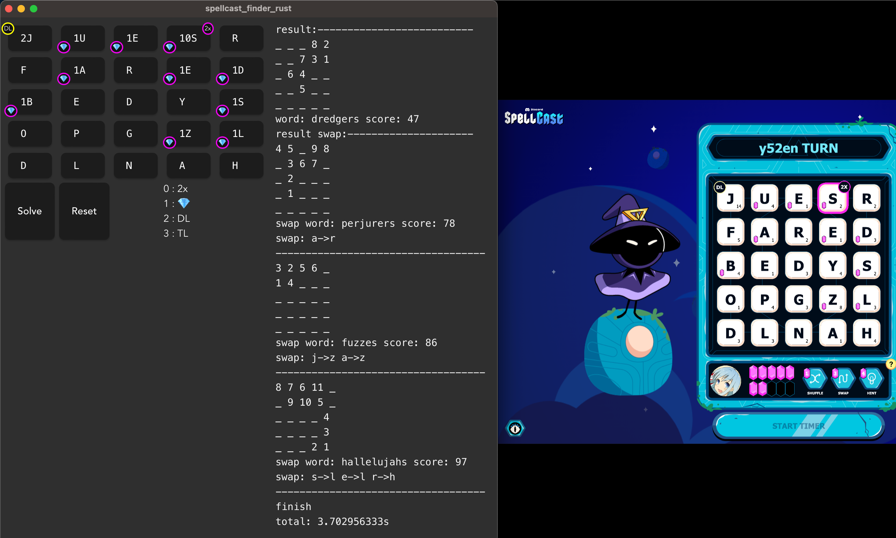

# spellcast_finder_rust


## features
- [x] Capable of searching up to 3 swaps
- [x] Supports multithreading
- [x] Dirty code
- [x] Bare minimum, user-unfriendly interface
- [x] Meaningless commit log

## building
```bash
npm run tauri build
```